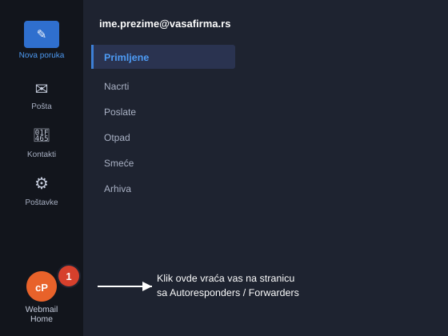
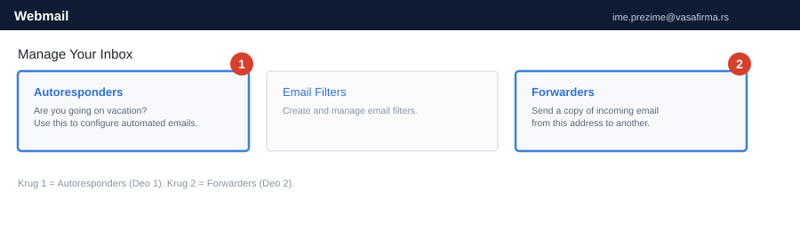
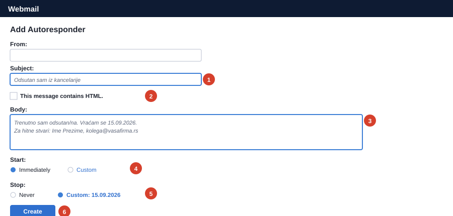
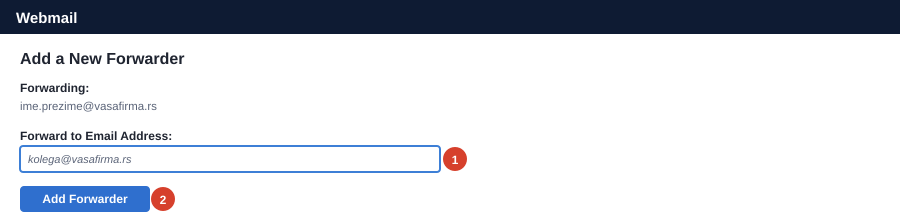

# cPanel Webmail: Out of Office i prosleđivanje pošte

Uputstvo za dve stvari na mejlu: automatski odgovor za vreme odsustva (Out of Office) i prosleđivanje dolazne pošte na drugu adresu (forwarding). Odnosi se na firme čiji mejl je hostovan preko **cPanel Webmail-a**.

---

## Pristup webmail-u

1. Otvorite internet pregledač i idite na adresu koju vam je AJTI dao za vaš mejl (obično oblika `webmail.vasafirma.rs`).
2. Unesite svoju mejl adresu i lozinku, zatim kliknite **Log in**.

!!! info "Ako ste već ulogovani i gledate svoje mejlove"
    Ako se stranica koju vidite sastoji od foldera (Primljene, Poslate...) umesto od kvadrata sa opcijama, već ste u inbox-u, a ne na početnoj stranici sa podešavanjima. U levom donjem uglu kliknite na ikonicu **Webmail Home** (crveno-narandžasti "cP" krug) da se vratite na stranicu sa svim opcijama.

    

---

## Deo 1: Automatski odgovor (Out of Office)

### Korak 1. Otvorite Autoresponders

Na početnoj stranici, u sekciji **Manage Your Inbox**, kliknite na **Autoresponders**.

### Korak 2. Dodajte automatski odgovor

Kliknite na dugme **Add Autoresponder** i popunite formu:

- **Subject**: naslov koji će primalac videti, na primer „Odsutan sam iz kancelarije".
- **Body**: tekst poruke, na primer „Trenutno sam odsutan/na. Vraćam se [datum]. Za hitne stvari kontaktirajte [ime i mejl kolege]."
- Polje **From** nije obavezno.
- **This message contains HTML**: ostavite neštiklirano, osim ako pravite poruku sa formatiranjem (bold, linkovi).
- **Start**: ostavite na **Immediately** da odgovor počne odmah čim sačuvate formu, ili izaberite **Custom** i unesite datum kada odsustvo počinje.
- **Stop**: izaberite **Custom** i unesite datum povratka na posao, da se odgovor sam isključi. Opcija **Never** znači da ostaje aktivan dok ga ručno ne obrišete.

Kliknite **Create**. Automatski odgovor je aktivan.

!!! tip "Preporuka"
    Uvek postavite datum na **Stop**, umesto **Never**. Tako se odgovor sam isključi kad se vratite i ne rizikujete da ostane upaljen mesecima.

### Kako da isključite automatski odgovor ranije

Ako se vratite pre planiranog datuma, vratite se na stranicu **Autoresponders**, pronađite svoju poruku u tabeli **Current Autoresponders** i kliknite **Delete** u koloni **Actions**.

---

## Deo 2: Prosleđivanje mejlova (Forwarders)

### Korak 1. Otvorite Forwarders

Na početnoj stranici kliknite na **Forwarders** (slika iz Dela 1, desni kvadrat).

### Korak 2. Dodajte prosleđivanje

Kliknite na dugme **Add Forwarder**, unesite adresu na koju želite da se prosleđuju mejlovi u polje **Forward to Email Address**, i kliknite **Add Forwarder**.

!!! warning "Važno"
    Prosleđivanje šalje **kopiju** svakog dolaznog mejla na drugu adresu. Originalna poruka i dalje ostaje u vašem inboxu, ne briše se i ne premešta. Da uklonite prosleđivanje, vratite se na stranicu **Forwarders** i kliknite **Delete** pored njega.

---

## Ako imate poteškoća

Kontaktirajte nas: [ajti.rs](https://ajti.rs).
